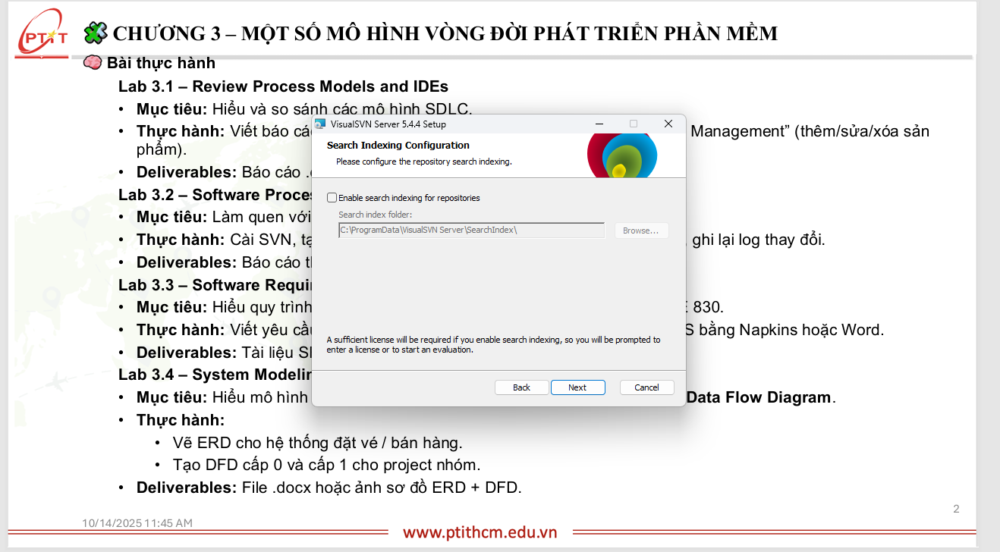

# Lab 3.2 – Software Process & Version Control with SVN

**Mục tiêu:** Làm quen với cấu hình và quản lý phiên bản bằng Subversion (SVN).  
**Thực hành:** Cài SVN, tạo repository, check-out/check-in, so sánh phiên bản, xem log.  
**Deliverables:** Báo cáo thao tác + ảnh chụp màn hình minh chứng.

---

# 1. Môi trường thực hiện

- Hệ điều hành: Windows
- Server: VisualSVN Server (GUI)
- Client: `svn` CLI (cmd) — thao tác trong `cmd` mở từ VisualSVN Server hoặc shell bình thường.

---

# 2. Cài đặt SVN

Các bước cài đặt (ảnh minh chứng kèm theo):

  
  
  
  
  
  
  


**Ghi chú:** Sau khi cài đặt VisualSVN Server, kiểm tra service đã chạy (VisualSVN Server service đang chạy).

---

# 3. Tạo Repository

1. Mở **VisualSVN Server Manager** → `Repositories` → `Create New Repository`.
2. Chọn tên repo (ví dụ `lab3`) và tick _Create default structure_ để tạo `trunk/branches/tags`.

Ảnh minh chứng thao tác tạo repo:

  
  
  
  
  
  


Nếu cần user để truy cập repo, tạo user trong VisualSVN:

  


Cuối cùng kiểm tra service vẫn chạy:


---

# 4. Lấy bản sao làm việc (Checkout)

**Lấy URL repo chính xác:** mở VisualSVN Server Manager → chọn repo → _Copy URL to Clipboard_  
Ví dụ URL:

```
https://desktop-aa1ok0s/svn/lab3/trunk
```

**Lệnh checkout (CLI):**

```cmd
svn checkout https://desktop-jamjaub/svn/lab3/
```

Ảnh minh chứng checkout:
  


**Ghi chú:** Nếu không dùng HTTP(S) hoặc làm trực tiếp trên máy chủ, có thể checkout bằng `file://`:

```cmd
svn checkout file:///C:/Repositories/lab3
```

---

# 5. Thao tác trên lab3 (CLI)

**Vào thư mục làm việc:**

```cmd
cd C:\Repositories\lab3
```

**Tạo file mới (Windows cmd):**

```cmd
echo Hello SVN > readme.txt
```

Ảnh:
  


**Thêm file vào version control:**

```cmd
svn add readme.txt
```

**Kiểm tra trạng thái:**

```cmd
svn status
```

Kết quả thông thường:

```
A       readme.txt
```

( `A` = Added, `M` = Modified, `?` = unversioned )

**Commit (check-in) thay đổi:**

```cmd
svn commit -m "Initial commit: add readme" --username admin --password YOUR_PASSWORD --non-interactive --trust-server-cert
```

**Xem diff giữa working copy và base:**

```cmd
svn diff readme.txt
```

Ảnh minh chứng:
  


**Xem lịch sử commit (log):**

```cmd
svn log -l 20
```

Ảnh minh chứng:


---

# 6. So sánh phiên bản (Compare revisions)

- Lấy log để biết số revision:

```cmd
svn log -r 1:HEAD
```

- So sánh hai revision:

```cmd
svn diff -r 1:2 path\to\file
```

Hoặc so sánh toàn thư mục:

```cmd
svn diff -r 3:4
```

**Mục đích:** kiểm tra chính xác nội dung đã thay đổi giữa các commit, phục hồi phiên bản trước nếu cần.

---

# 7. Quy trình tốt khi làm việc với SVN

- **Không sửa trực tiếp** trong thư mục repository (ví dụ `C:\Repositories\lab3`). Luôn thao tác trong **working copy** rồi commit.
- Trước khi commit, chạy `svn update` để lấy thay đổi mới nhất và tránh conflict:

```cmd
svn update
```

- Nếu xảy ra conflict, SVN sẽ báo `C` trong `svn status`. Giải quyết conflict thủ công, `svn resolved` sau khi sửa xong.
- Dùng commit message rõ ràng: `Feature/bugfix: short description` để dễ tra cứu.

---

# 8. Troubleshooting (vấn đề phổ biến đã gặp)

- **HTTP 404 / Not Found:** có thể URL sai hoặc repo chưa được publish trong VisualSVN. Dùng _Copy URL_ từ GUI để đảm bảo chính xác.
- **`does not support the HTTP/DAV protocol`:** thường do bạn đang truy cập đường dẫn không phải DAV endpoint (ví dụ chứa ký tự lạ `%23` hay `!/`). Đảm bảo URL dạng:
  ```
  https://<hostname>/svn/<repo>
  ```
  và service VisualSVN đang chạy. Nếu repo tên chứa ký tự đặc biệt (ví dụ `#`), tốt nhất **tạo lại repo** với tên hợp lệ (ví dụ `lab3`).

---

# 9. Tài liệu tham khảo / lệnh thường dùng

```txt
svn checkout <URL> <PATH>
svn add <file>
svn status
svn commit -m "message"
svn diff -r N:M <file>
svn log
svn update
```
