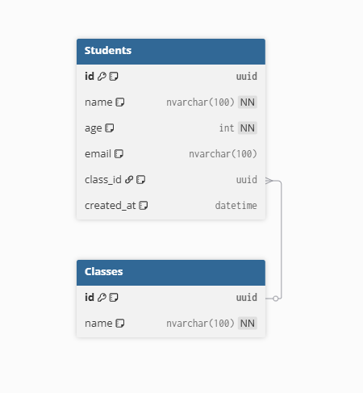

# 🧩 Lab 4 – Thiết kế, Kiểm thử & Triển khai (MVC + SOA)

## 👨‍💻 Thông tin sinh viên

-   **Họ tên:** Ngô Quốc Hưng
-   **MSSV:** K24DTCN414

---

## 🎯 1. Mục tiêu bài lab

-   Thiết kế giao diện và CSDL cho hệ thống mẫu
-   Ứng dụng mô hình **MVC + SOA**
-   Kiểm thử đơn vị (Unit Test)
-   Quản lý lỗi với GitHub Issues / Mentis
-   Đóng gói và triển khai ứng dụng

---

## 🗃️ 2. Thiết kế cơ sở dữ liệu

**Bảng: Students**

| Cột        | Kiểu dữ liệu     | Ghi chú        |
| ---------- | ---------------- | -------------- |
| id         | UNIQUEIDENTIFIER | Khóa chính     |
| name       | NVARCHAR(100)    | Họ tên         |
| age        | INT              | Tuổi           |
| email      | NVARCHAR(100)    | Email duy nhất |
| created_at | DATETIME         | Ngày tạo       |

📊 **Sơ đồ (Database Diagram)**  


---

## 🧩 3. Kiến trúc MVC + SOA

**Cấu trúc thư mục**
server: student-management
src/
├── models/ → Định nghĩa kiểu dữ liệu
├── services/ → Tầng xử lý logic & gọi DB
├── controllers/ → Nhận request, gọi service
├── routes/ → Định tuyến API
├── database/ → Kết nối SQL Server
└── server.ts → Khởi động server

client: ui-react
src/
├── components/ → UI component
├── App.tsx → App
└── main.tsx → Khởi động client

**Luồng hoạt động**
Client → Route → Controller → Service → Database

---

## 🧪 4. Kiểm thử đơn vị (Unit Test)

Sử dụng **Jest + Supertest**.

Ví dụ: `tests/student.test.ts`

```ts
import request from "supertest";
import app from "../src/app";

describe("Student API", () => {
    it("GET /students should return list", async () => {
        const res = await request(app).get("/students");
        expect(res.status).toBe(200);
    });
});
```


